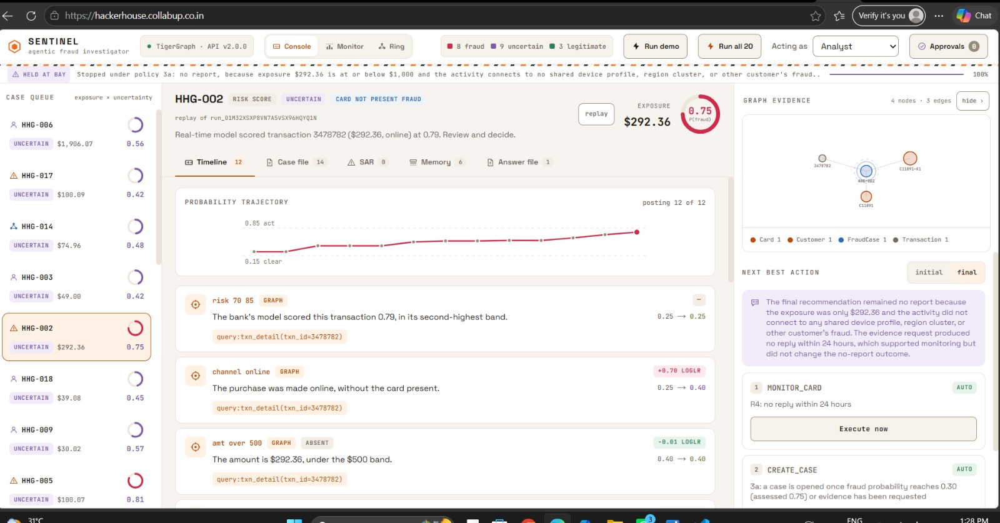
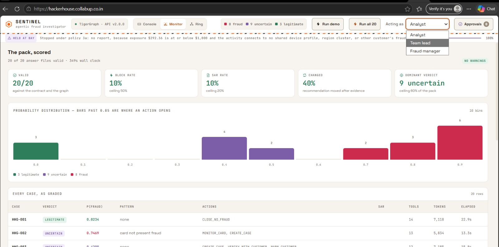
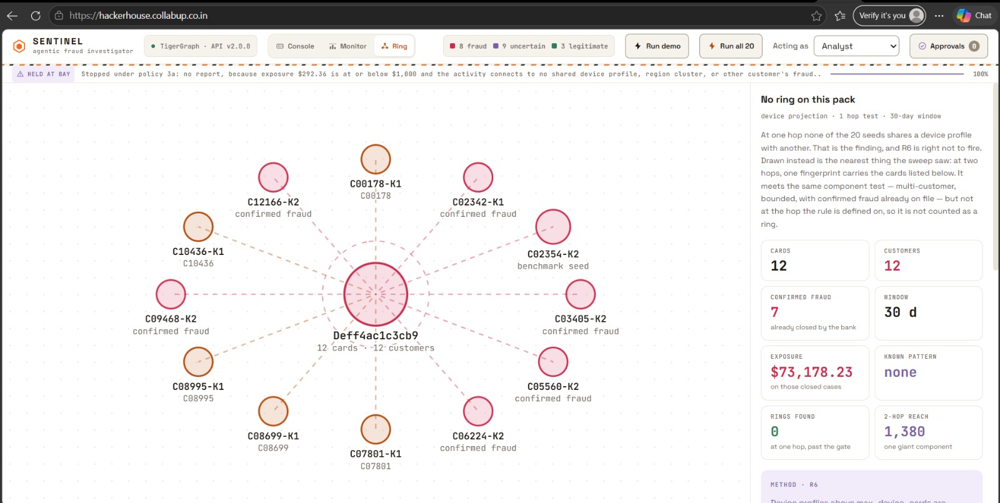
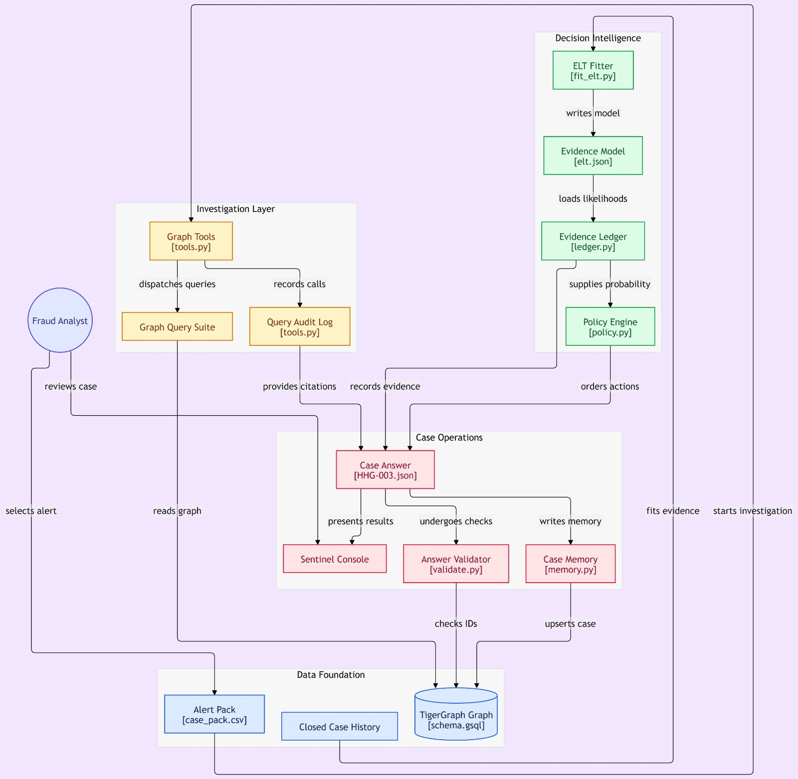

# Sentinel — Agentic Fraud Investigation on TigerGraph

An agent that investigates a fraud alert against a TigerGraph knowledge graph,
accumulates what it finds into a calibrated probability ledger, decides under a
deterministic policy engine whether it has enough to act, asks for more evidence
when it does not, and produces a case file, a before-and-after next-best-action
pair with approval routes, and a suspicious activity report when policy requires
one — then writes the case back into the graph so the next investigation can
find it.

Built for the TigerGraph Agentic Fraud Investigation challenge, Hacker House Goa,
by **Team CollabUp**.

## Links

| | |
|---|---|
| 🔗 **Live app** | https://hackerhouse.collabup.co.in |
| 📘 **API docs** | https://apihacker.collabup.co.in/api/docs |
| 💻 **Code** | https://github.com/r-rishit27/hacker_house/tree/sentinel-v2 |
| ✍️ **Write-up** | [Sentinel: an agentic fraud investigator on TigerGraph that knows when *not* to block](https://medium.com/@r.rishit27/sentinel-an-agentic-fraud-investigator-on-tigergraph-that-knows-when-not-to-block-41b8e706116e) |

The TigerGraph Savanna workspace auto-stops when idle. The first request to the
live app takes about 45 seconds while it wakes; after that it is warm.

---

## The console

Every claim on the timeline carries the GSQL query that produced it, and the
probability trajectory shows each finding moving the number. Here HHG-002 is
held at 0.75 — `MONITOR_CARD` and `CREATE_CASE`, but no report, because the
$292.36 exposure sits under the $1,000 threshold and nothing connects to a
shared device or another customer's fraud.



The scorecard grades all twenty at once. Note the block rate of 10% against a
50% ceiling, and nine cases honestly marked uncertain rather than forced into a
verdict. The role switcher is what makes the approval boundary real — an analyst
cannot execute an `L1` action.



The Ring view is the one that reports a negative honestly. One device
fingerprint carries 12 cards across 12 customers, 7 of them already closed as
fraud by the bank, with $73,178.23 of exposure behind them — and Sentinel still
answers **no ring**, because R6 is defined at one hop and that component only
appears at two. The panel draws what the sweep saw and says why the rule does
not fire, rather than inventing a ring out of a suggestive picture.



---

## Architecture

Facts come from the graph, belief from a fitted evidence ledger, and decisions
from a policy engine. The language model plans and narrates; it never picks an
action or an approval route.



---

## Start here, in ten minutes

```bash
git clone <this repo> && cd hacker_house

# 1. Environment. Python 3.12; uv is optional but fast.
uv venv --python 3.12 .venv
VIRTUAL_ENV=.venv uv pip install -e "backend[dev,scripts]"
#   or: python3.12 -m venv .venv && .venv/bin/pip install -e "backend[dev,scripts]"

# 2. Credentials.
cp .env.example .env     # fill TG_HOST, TG_SECRET, OPENAI_API_KEY and the two model ids

# 3. Check every assumption a run makes, and see which one is false.
.venv/bin/python -m sentinel doctor

# 4. Investigate one case, end to end, against the live graph and the live model.
.venv/bin/python -m sentinel run --case HHG-003
```

That last command reads the alert, runs ten numbered steps, writes
`cases/HHG-003.json`, validates every id in it against the graph, and upserts a
`FraudCase` vertex with eight edge types. It takes about twenty seconds and
costs about a cent.

To reproduce the whole submission:

```bash
.venv/bin/python -m sentinel ingest --what all     # GraphRAG corpus, ~4 min, ~$0.01
.venv/bin/python -m sentinel run --all             # 20 cases, ~6 min
.venv/bin/python -m sentinel validate              # 20/20, with graph checks
```

The console:

```bash
.venv/bin/python -m uvicorn api.main:app --app-dir backend --port 8000
cd frontend && npm install && npm run dev          # http://localhost:3000
```

---

## What it does, against what the brief asked for

| The brief asks for | Where it is |
|---|---|
| Investigate on a fraud signal, a customer report or an analyst request | `backend/sentinel/domain/alert.py`, and the three trigger priors in `elt.json` |
| Gather evidence from the graph, history, device and identity signals, prior cases | 19 typed tools over 26 installed GSQL queries — `backend/sentinel/tools/` |
| Identify the pattern and assess risk | `AssessmentAgent` names it; `EvidenceLedger` prices it — `backend/sentinel/evidence/` |
| Create and progress a case, write it to the graph | `WriteStep` + `CaseMemoryStore` — one `FraudCase`, eight edge types, one POST |
| Use case memory to improve investigations | `GraphRagRetriever` — cosine over 5,611 stored vectors fused with graph structure |
| Gather more evidence through controlled actions | `RequestEvidenceStep` + `EvidenceSimulator`, four branches from measured bases |
| Recommend one or more next actions | `PolicyEngine` — R1–R10, 14 actions, three routes, no model in the path |
| Operate within policies and permissions | `RoutePermissionPolicy`; only `auto` executes, `L1`/`L2` wait for a human |
| Decide when to stop | `StoppingPolicy` — Policy §6, as written |
| Explain the reasoning | Every claim carries a re-runnable `ref`; every rule cites its `PolicyDoc` |

### Required components

| | |
|---|---|
| **TigerGraph Savanna** | 12 vertex types, 20 edge types, 590,742 transactions, 5,565 closed cases |
| **GSQL and graph traversal** | 26 installed queries, all with source in `graph/queries/` |
| **TigerGraph MCP** | `tigergraph-mcp` over stdio, 69 tools — `python scripts/setup_mcp.py --check` |
| **GraphRAG** | 46 `PolicyDoc` chunks parsed from the brief, 5,565 `ClosedCase.emb`, hybrid retrieval |
| **User interface** | Next.js analyst console over the FastAPI service |

---

## Three rules this repo holds to

**1. No graded field comes from free-form model text.** Transaction ids, card
ids, amounts, exposure, action names, approval routes and the SAR filing
decision all come from a GSQL query or from the policy engine. The model writes
seven prose strings and nothing else — they live in one object,
`Narration`, so the boundary is checkable rather than aspirational. Every id in
an answer file is proved to exist in the graph before the file is written.

**2. What the agent asks is deterministic; what it *says* is not.** Four
identical runs of HHG-003 once returned three different probabilities because
the planner added a different detector set each time. A fitted likelihood ratio
that never posts is not neutral — it is missing from the sum. The detector set
is now a function of the trigger type; the planner decides the order and states
why. Three consecutive runs agree to four decimal places.

**3. The public IEEE-CIS / Kaggle files are never opened.** Ids, times and
amounts here were transformed so that outcomes cannot be looked up there. Doing
so is disqualification. They were not downloaded, opened or referenced.

---

## How it is put together

```
alert ─▶ scope ─▶ plan ─▶ sweep ─▶ recall ─▶ assess ─▶ stop_test ─▶ request_evidence
                                                                          │
        write ◀── narrate ◀── decide ◀────────────────────────────────────┘
```

Ten numbered steps over one shared context. Six of the ten touch no model at
all — that is the point. The model chooses what to ask, names what it sees and
writes the prose; everything that becomes a graded number or a policy decision
is computed.

| Package | What it owns |
|---|---|
| `backend/sentinel/graph/` | The only door to TigerGraph: REST++ over httpx, cold-start detection, token re-mint, batched upsert, and the normaliser that turns `-1.797e308` and `1970-01-01` into `None` |
| `backend/sentinel/tools/` | 19 typed tools, one `QueryLog` per investigation, and `EvidenceRef` — the single place a citation string is built |
| `backend/sentinel/evidence/` | The fitted likelihood table (29 features, 11 groups) and the log-odds ledger with symmetric group caps |
| `backend/sentinel/policy/` | The Fraud Policy as tested code: `PolicyEngine`, `RoutingTable`, `SarPolicy`, `StoppingPolicy`, six gates |
| `backend/sentinel/rag/` | Corpus, embeddings, vector index, hybrid retriever |
| `backend/sentinel/memory/` | Case write-back: one vertex, eight edge types, one round trip |
| `backend/sentinel/agents/` | The orchestrator, the ten steps, four LLM agents, the assembler |
| `backend/sentinel/validation/` | The pure validator, and the graph identity checker that proves every id |
| `backend/api/` | FastAPI: SSE with `Last-Event-ID` replay, the action/approval boundary, the audit log |
| `frontend/` | The analyst console |
| `etl/`, `scripts/` | Offline data preparation and one-shot graph loading. Deliberately separate from the agent |

### Retrieval is hybrid, and that is not decoration

Pure vector search over a graph database is a bad demo and a worse retriever.
Two independent rankings run and are fused by reciprocal rank fusion, because
a cosine and a hop count have no common scale:

- **Vector** finds a case that *reads* like this one — a note describing a
  disputed recurring charge, whatever card it happened on.
- **Structural** finds a case the graph *connects* to this one — same card,
  same customer, same pattern in the same exposure band.

Each surviving hit is expanded back through the graph for its provenance, which
is what the console's memory tab renders. On HHG-003 the retriever returns five
of the six closed cases the hand investigation found, and `POL-R7` — "disputed
but legitimate" — as the top policy chunk for a query describing it.

A hard filter applies before fusion: `opened_at < as_of`. A case may never
retrieve an investigation that had not happened yet. The twenty run in
chronological order and write their own vertices as they go, so without that
filter the memory claim would be a leak rather than a capability.

---

## Where the documents are

| Path | What |
|---|---|
| [Guide.md](Guide.md) | **The organiser's brief.** The authority whenever anything here disagrees with it |
| [docs/system/STATUS.md](docs/system/STATUS.md) | Where the build stands, with the command output behind every claim |
| [docs/system/PRD.md](docs/system/PRD.md) | Requirements, principles, the scoring map |
| [docs/system/HLD.md](docs/system/HLD.md) | Architecture and nine ADRs |
| [docs/system/LLD.md](docs/system/LLD.md) | Class-level design, algorithms, the test matrix |
| [docs/system/TECHNICAL.md](docs/system/TECHNICAL.md) | Stack, setup, the endpoint table, the SSE contract, the runbook |
| [docs/system/EXECUTION_PLAN.md](docs/system/EXECUTION_PLAN.md) | Tasks, milestones, risks, the cut list |
| [docs/HAND_INVESTIGATION.md](docs/HAND_INVESTIGATION.md) | HHG-003 worked by hand before any agent code was written |
| [docs/CALIBRATION.md](docs/CALIBRATION.md) | How `fraud_probability` is fitted, and the selection-bias trap |
| [docs/Data_loading_startergy.md](docs/Data_loading_startergy.md) | How the data gets into TigerGraph, and what had to be derived |
| [docs/TOOLS_AND_MCP.md](docs/TOOLS_AND_MCP.md) | The 19 typed tools, the 26 GSQL queries, and the MCP server |
| [frontend/DESIGN_SYSTEM.md](frontend/DESIGN_SYSTEM.md) | Tokens, semantics, components, contrast |
| [deploy/Deployment_Doc.md](deploy/Deployment_Doc.md) | **Deploying it** — the API on EC2 behind nginx, the console on Amplify |
| [docs/img/](docs/img/) | The architecture diagram and the console screenshots above |
| `cases/` | **The deliverable** — one answer file per benchmark case |
| `exploration/` | Autonomous findings. Never part of a graded answer |

---

## The dataset

IEEE-CIS Fraud Detection (Vesta Corporation), repackaged by TigerGraph: 590,742
transactions over six months from 13,553 customers, 144,432 identity records,
5,565 closed investigations, and 20 benchmark alerts. Every transaction carries
a risk score from the bank's model. There is no fraud label.

| File | Size | Tracked | What it is |
|---|---|---|---|
| [Guide.md](Guide.md) | 39 KB | yes | The brief: task, glossary, columns, the five patterns, the regulatory sources, the Fraud Policy and the answer-file contract |
| [case_pack.csv](case_pack.csv) | 4 KB | yes | The 20 benchmark alerts |
| [closed_cases_history.csv](closed_cases_history.csv) | 2.7 MB | yes | 5,565 finished investigations — 4,665 confirmed fraud, 900 cleared. The only place ground truth is written down |
| [identity.csv](identity.csv) | 27 MB | yes | 144,432 device and connection records, online transactions only |
| `transactions.csv` | 708 MB | **no** | Over GitHub's limit. Needed only to regenerate staging |
| [data/staging/](data/staging/) | 49 MB | yes | The thirteen loader-ready files. **Enough on their own to rebuild the graph** |

### Rebuilding the graph

The staged data is committed, so the 708 MB source is not needed:

```bash
.venv/bin/python scripts/load_to_tigergraph.py    # schema, jobs, load, verify — ~1.3 min
.venv/bin/python scripts/install_queries.py       # 26 queries, created then installed
.venv/bin/python -m sentinel ingest --what all    # the GraphRAG corpus
```

The staged transaction file is 187 MB, so the committed copy is gzipped to
30 MB and the loader reads either form. To regenerate staging from source,
download `transactions.csv` into the repository root and run
`scripts/prepare_data.py`; it rebuilds every staged file and runs five
integrity checks, exiting non-zero if any fail.

---

## Running the checks

```bash
cd backend
../.venv/bin/python -m pytest tests/unit tests/integration -q   # no credentials needed
../.venv/bin/python -m pytest tests/live -m live -q             # needs the workspace
../.venv/bin/python -m ruff check sentinel api tests
../.venv/bin/python -m ruff format --check sentinel api tests
../.venv/bin/python -m mypy --strict sentinel api
```

The unit and integration suites run against `FakeGraphRepository` and a stub
model, so they need no network and no credentials. That is what lets the agent
be developed while the Savanna workspace is asleep.

---

Roughly half the benchmark cases are legitimate, and an agent that blocks
everything scores badly. That single constraint drives most of the design.
